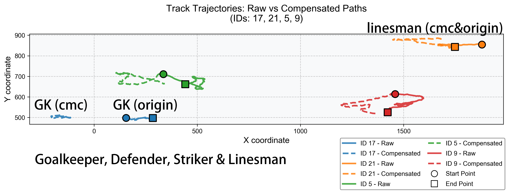

# AI Goalkeeper Highlight Generator

目前该项目为研究/学习级产品，用于跟踪足球比赛中的人和球，并识别出守门员、计算威胁程度，用于最终自动生成守门员处理球集锦（未实现）。


<p align="center">输出视频示例</p>


<p align="center">相机运动补偿后效果平面展示</p>

## 已实现功能

- 对比赛视频中**人（球员、守门员、教练、裁判）和球**进行检测与跟踪（基于 YOLO + ByteTrack）
- CMC 相机运动补偿，抵消相机转动的影响
- 通过位置特征 (目前仅依靠x、y坐标) 排除裁判并识别守门员候选人

---

## 使用的技术与依赖

- 检测模型：[football-players-detection](https://universe.roboflow.com/roboflow-jvuqo/football-players-detection-3zvbcYOLOv11m)
- 跟踪器：ByteTrack（配置文件 `bytetrack.yaml`）
- 可视化：OpenCV
- 语言：Python 3.10

安装依赖：

```bash
pip install -r requirements.txt
```

---

## 使用教程

> 模型文件 ~~曾使用 YOLOv11m~~ [football-players-detection](https://universe.roboflow.com/roboflow-jvuqo/football-players-detection-3zvbcYOLOv11m)，自行训练或在 [蓝奏云](https://wwbcc.lanzoup.com/iDH023f1y7zg) 下载模型
> 测试比赛视频已内置于 `input_vids/` 中

1. 将模型文件放入 `models/`, 将比赛视频放入 `input_vids/` 
2. 在 main.py 中修改 `model` 和 `VIDEO_PATH` 为你的文件路径
3. 运行 main.py

4. 处理完成后：
   - 跟踪日志保存到 `output/track_log.csv`
   - 可运行 `draw_2d.py` 查看可视化结果

---

## TODO
制作守门员处理球集锦（包括关键动作剪辑、威胁评分与可视化）
- [ ] 自动生成守门员处理球集锦
- [ ] 威胁度评分（结合位置、球速、对方球员密度等特征）
- [ ] 守门员姿态分析、运动速度轨迹分析

---

## 🤝 贡献与联系

欢迎提交 issues 或 PR，亦可通过 hungryhenry101@outlook.com 进行联系